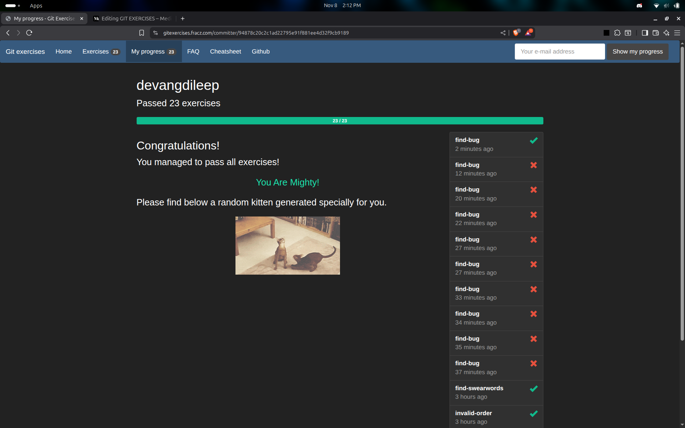

# Git Exercises
 
I learned how to use git and how to handle different situation using git commands

##  Medium Blog

Read my detailed write up on medium:  
[Git Exercises — medium post](https://medium.com/@devangdileep123/30473a6fed7d)

## Some of the commands i practiced

- `git add`  
- `git commit`  
- `git rm`  
- `git stash`  
- `git rebase`  
- `git cherry-pick`  
- `git bisect`  
- `git merge`  
- `git log`  
- `git reflog`  
- `git reset`  
- `git branch`  
- `git checkout`

## Outcome of this exercise

This exercise helped me to :
- Practice real git commands  
- Understand how commits, branches, and merges work  
- Learn to handle conflicts and debugging commits efficiently

## Completed Page

